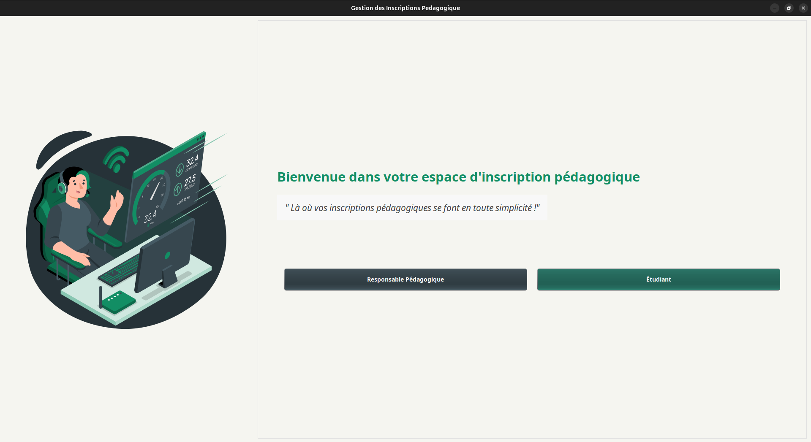

# Gestion des Inscriptions Pédagogiques

## Université Assane Seck de Ziguinchor

### Description

Ce projet est une application Java permettant de gérer les inscriptions pédagogiques dans un établissement d'enseignement supérieur. Il automatise l'inscription des étudiants, la validation par les responsables pédagogiques et la répartition des étudiants dans les groupes de TD et TP.

### Fonctionnalités

* **Gestion des inscriptions pédagogiques** : Inscription des étudiants aux formations et unités d'enseignement (UE).
* **Validation et refus des inscriptions** : Traitement des demandes par les responsables pédagogiques.
* **Répartition automatique des étudiants** : Attribution équilibrée des étudiants dans les groupes de TD et TP selon un algorithme alphabétique.
* **Exportation des données** : Génération de fichiers PDF et CSV pour le suivi administratif.
* **Gestion des profils utilisateurs** : Consultation et modification des informations personnelles.

### Aperçu de l'application

#### Écran d'accueil



#### Interface de connexion pour les etudiants


#### Interface d'accueil des etudiants


#### Interface d'accueil des responsable


### Technologies utilisées

* **Langage** : Java
* **Interface graphique** : Swing
* **Base de données** : Hibernate (JPA)
* **Génération de documents** : OpenPDF
* **Envoi d’e-mails** : Jakarta Mail
* **Architecture** : MVC (Modèle-Vue-Contrôleur)

### Structure du projet

```
src/
├── main/
│   ├── java/
│   │   └── sn/uasz/m1/inscription
│   │       ├── dao/
│   │       ├── service/
│   │       ├── controller/
│   │       ├── model/
│   │       ├── email/
│   │       ├── fixtures/
│   │       ├── util/
│   │       ├── view/
│   ├── resources/
│   │   ├── META-INF/
│   │   │   └── persistence.xml
│   │   ├── static/
│   │   ├── logback.xml
├── test/
│   └── sn/uasz/m1/inscription
└── pom.xml
```

---

### Installation et exécution

1. **Cloner le projet** :

   ```sh
   git clone https://github.com/eadarak00/gestion_inscription_pedagogique.git
   cd gestion_inscription_pedagogique
   ```

2. **Configurer la base de données** :
   Modifier le fichier `persistence.xml` avec les paramètres de connexion (**MariaDB**).

3. **Compiler et exécuter** :

   ```sh
   mvn clean install
   mvn exec:java -Dexec.mainClass="sn.uasz.m1.inscription.Main"
   ```

### Exportation de données

* **PDF** : Liste des étudiants inscrits à une UE avec le logo de l’université, la date d’exportation et l’identité de l’exportateur.
* **CSV** : Liste des étudiants répartis dans un groupe de TD.


### Développé par

* **El Hadji Abdou DRAME** - [eha.d1@zig.univ.sn](mailto:eha.d1@zig.univ.sn)
* **Safietou DIALLO** - [s.d81@zig.univ.sn](mailto:s.d81@zig.univ.sn)

Université Assane Seck de Ziguinchor